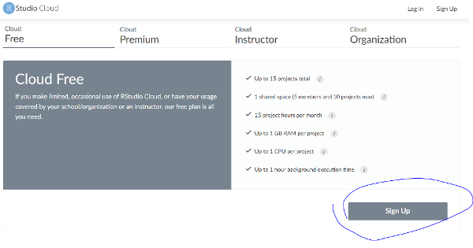
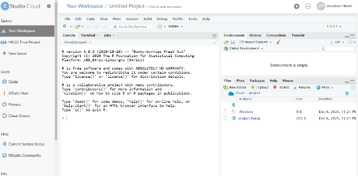

# Machine Learning at Central Banks, Part 2
#### Dec 7th, 12pm - 3pm Belize Time
#### Instructor: Jonathan Hersh, PhD (hersh@chapman.edu)

## Getting Started

Hello! These are the materials for the Dec 7th R and Machine Learning training. The topics covered will include:

1. Intro to R Programming with the [Tidyverse](https://www.tidyverse.org/) 
1. Data Visualization Using R and [ggplot](https://ggplot2.tidyverse.org/)
1. Regression trees, bagging, and random forests

------

## Computing and Installation Instructions

We will be coding in the R together during this training. I don't presume **any** knowledge of coding, so don't be afraid if you've never coded before. 

There are two ways you can run R and [RStudio](https://rstudio.com/), either locally on your computer, or on the cloud in [rstudio.cloud](rstudio.cloud)

### Installing R Locally

If you would like to install and run R locally please install the following programs:

* RStudio Desktop 1.3.1093 [link](https://rstudio.com/products/rstudio/download/#download)
* R 4.0.3 [link](https://cran.r-project.org/bin/windows/base/)

### Running R in a Web Browser

If you cannot install those programs, please head over to [rstudio.cloud](rstudio.cloud). 

* Click "GET STARTED FOR FREE" 
* Then click "Sign Up". 

* You may log in using your email address
* Next click new project. 
* You should now see a R Studio session in your browser. 

### Using Github

If you have never used Github, don't worry. You can either clone the repository, or you may click the "Code" button on the main page, and then "Download Zip" to download all the files. You may also download the files individually, or copy and paste code as needed. 

### Loading Project in R

install.packages('usethis')
install.packages('tidyverse')

newProject <- usethis::use_course('https://github.com/jonhersh/ML_Central_Bank_Belize_2/archive/main.zip')

